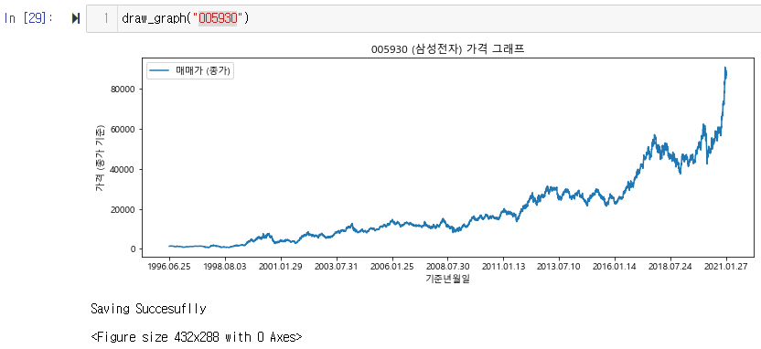

## Naver 에서 주식가격/환율 정보를 스크래핑 해오는 코드입니다

> BeautifulSoup 를 이용한 스크래핑 코드


### 1. 현재 환율 구하기

```python
# 현재 환율을 구해서 출력합니다
def get_now_exchange():
    
    html = urlopen("https://finance.naver.com/marketindex/exchangeList.nhn")
    bsObject = BeautifulSoup(html, "html.parser")

    exchange_data = []
    bs = bsObject.select('div.tbl_area tbody tr')
    for i,temp in enumerate(bs):
        if i < 2: continue
        country = temp.select("a")[0].get_text().strip()
        exchange = temp.select("td")[1].get_text()
        exchange_data.append([country , exchange]) 
    
    for e in exchange_data:
        print(e)
    return
```

---


### 2.  각 나라의 지난 환율가격들을 보여주는 링크 구하기

```python
# 각 나라마다 환율 정보가 담긴 홈페이지 링크를 주기 , 저장
def get_country_exchange_link():
    hompage_link = "https://finance.naver.com/"
    base_link = "https://finance.naver.com/marketindex/exchangeList.nhn"
    html = urlopen(base_link)
    bsObject = BeautifulSoup(html, "html.parser")
    cover = bsObject.select("td.tit>a")

    country_index = []
    exchanges_daily_link = []
    
    for i,cover2 in enumerate(cover):
        country =  cover2.get("href")[-6:-1]
        country_link = hompage_link + cover2.get("href")
        country_html = urlopen(country_link)
        country_bs = BeautifulSoup(country_html, "html.parser")
        country_daily_link = hompage_link + country_bs.select("iframe[title=일별시세]")[0].get("src")
        
        country_index.append(country)
        exchanges_daily_link.append(country_daily_link)
    
    df = pd.DataFrame([exchanges_daily_link] , columns=country_index)
    df.to_excel("countries daily exchange link.xlsx" , index=False)
    print("complete saving link")
```

---


### 3. 전체 환율 정보 스크래핑 함수

> 1). 환율정보 링크가 제대로 걸려있는지 확인

```python
# 전체 나라들에 대해서 환율 스크래핑 
def get_exchange():
    
    df = pd.read_excel("countries daily exchange link.xlsx" , engine="openpyxl")
    date_index = []
    exchanges = []
    for link in df.loc[0]:
        # 각 나라의 환율정보가 들어가 있는 홈페이지 링크 출력
        print(link)
```


>2).  BeautifulSoup 를 이용해서 환율 정보 파싱

```
# 전체 나라들에 대해서 환율 스크래핑 
def get_exchange():
    
    df = pd.read_excel("countries daily exchange link.xlsx" , engine="openpyxl")
    date_index = []
    exchanges = []
    for link in df.loc[0]:
        # 각 나라의 환율정보가 들어가 있는 홈페이지 링크 출력
        
        html = urlopen(link)
        bs = BeautifulSoup(html, "html.parser")
        bs_select = bs.select("table.tbl_exchange.today tbody tr")
        
        for bs_sub in bs_select:
            bs_sub2 = bs_sub.select("td")
            date = bs_sub2[0].get_text()
            exchange = bs_sub2[1].get_text()
            print(date , exchange)
            print("----------")
            
        break
```


# 2. 주식 가격 스크래핑 해오기


```
chrome_driver_path = ".."
from matplotlib import font_manager , rc
import platform
```


> 스크래핑할 url / 데이터 확인

```python
# 삼성전자 관련 메인 페이지 url
html = urlopen('https://finance.naver.com/item/main.nhn?code=005930')
bsObject = BeautifulSoup(html, "html.parser")
bs = bsObject.select("dl.blind dd")
print(bs)
```

 


> 삼성전자 스크래핑

```python
driver = webdriver.Chrome("./chromedriver.exe")

prices = []
date = []

# 우선 10 페이지만 테스트
for page in range(1,11):
    url = "https://finance.naver.com/item/sise_day.nhn?code=035720" + "&page=" + str(page)
    driver.get(url)
    date_sel = driver.find_elements_by_css_selector("span.tah.p10.gray03")
    price_sel= driver.find_elements_by_css_selector("span.tah.p11")
    for d in date_sel:
        date.append(d.text)
	# 가격은 매매종가 기준
    for i,p in enumerate(price_sel):
        if i% 6 == 0:
            prices.append(p.text)
            
df = pd.DataFrame({"price (종가)" : prices})
df.index = date
df
```


```python
plt.plot(df["price (종가)"].values)
df["price (종가)"]
```


 : 뭐가 문제일까 싶어서 10개만 확인해보았더니 가격 데이터가 `int` 형태가 아닌 `str` 형태로 저장되 있었다

```python
plt.plot(df["price (종가)"].values[0:10])
```


> 가격데이터 int 변환

```python
prices = []
date = []

# 우선 10 페이지만 테스트
for page in range(1,11):
    url = "https://finance.naver.com/item/sise_day.nhn?code=005930" + "&page=" + str(page)
    driver.get(url)
    date_sel = driver.find_elements_by_css_selector("span.tah.p10.gray03")
    price_sel= driver.find_elements_by_css_selector("span.tah.p11")
    for d in date_sel:
        date.append(d.text)

    for i,p in enumerate(price_sel):
        if i%6 == 0: prices.append(int(p.text.replace(',',"")))
            
df = pd.DataFrame({"price (종가)" : prices})
df.index = date
plt.plot(df["price (종가)"].values)
```



​	:  `int` 형으로 바꾸었더니 정상적으로 출력되었다. 


> 그래프를 좀 더 그럴듯하게 그려보자

```python
from matplotlib import font_manager , rc
import platform

# matplot 에서 한글 폰트 사용
if platform.system() == "Windows":
    path =  "c:/Windows/Fonts/malgun.ttf"
    font_name = font_manager.FontProperties(fname=path).get_name()
    rc('font' , family =  font_name)

# 좀 더 그럴듯하게 그려보기
plt.figure(figsize=(12,4))
plt.plot(df["price (종가)"] , label = "Price")
plt.title("주식 가격 그래프")
plt.xlabel("기준 년월")
plt.ylabel("주식 가격 (종가 기준)")
plt.legend()
plt.show()
```

​	:  한글폰트를  사용하고 제목과 x축/y축/범례를 추가해주었다 


   x 축이 굉장히 좁아보인다. x 축 눈금을 알아볼 수 있도록 조정해보겠다.


> X 축 눈금 조정 

```python
# X 축에서 눈금이 len_xticks 개수만큼만 보이도록 설정
xticks = []
len_xticks = 10
for i in range(len(df)):
    num_divide = int(len(df)/len_xticks)
    if i%num_divide == 0:
        xticks.append(df.index[i])
xticks.append(df.index[-1])

plt.xticks(xticks)

plt.show()
```

.png)

  그럴듯하게 그래프가 나왔다 , 최신순으로 데이터를 append 했기 때문에 그래프가 거꾸로 나왔다. 스크래핑한 데이터를 `reverse` 시켜서 뒤집어 주고 10 페이지가 아닌 `for`문 이 아닌 `while` 문을 이용해 삼성전자에 대한 일일매매가 데이터 전체 페이지를 스크래핑을 해보자


> 삼성전자 일일매매가 전체 페이지 스크래핑

​	:  NaverFinance 에서는 마지막페이지가 넘어가면 몇페이지든간에 마지막페이지로 돌아오게 설정되있다. 따라서 마지막페이지인지 체크하기위해 이전 페이지의 날짜값을 저장하고 현재 페이지와 비교하면서 루프를 돌게 구현하였다

```python
code_number = "005930"
page = 0
prices = []
date = []

pv_date = ""
while(1):
    page += 1
    url = "https://finance.naver.com/item/sise_day.nhn?code=" + code_number + "&page=" + str(page)
    driver.get(url)
    date_sel = driver.find_elements_by_css_selector("span.tah.p10.gray03")
    price_sel= driver.find_elements_by_css_selector("span.tah.p11")
    
    now_date = date_sel[0].text
    if pv_date == now_date: break
    else:
        pv_date = now_date
    for d in date_sel:
        date.append(d.text)

    for i,p in enumerate(price_sel):
        if i% 6 == 0:
            prices.append(int(p.text.replace(",","")))
            
price.reverse()
date.reverse()
df = pd.DataFrame({"price(종가)" : prices})
df.index = date

df

```


​	:  총 6180 개의 데이터, 즉 6180일, 대략 17년 정도의 주식가격을 얻을 수 있었다.

다음은 삼성전자가 아닌 종목을 코드번호로 입력받아 내가 원하는 종목을 스크래핑 할 수 있도록 해보자  


> 종목 코드를 입력받고 유효한지 확인

​	:  실제 네이버 사이트에서 잘못된 종목코드로 이동하면 자동적으로 Error 메세지가 있는 링크로 이동이 되기 때문에 이를 감지하여 유효한 종목코드인지를 확인하는 함수를 만들었다

```python
def get_stock_prices(code_number):

    driver = webdriver.Chrome("./chromedriver.exe")
    url = "https://finance.naver.com/item/main.nhn?code=" + code_number
    driver.get(url)
    if driver.find_elements_by_css_selector("div.error_content"):
        print("잘못된 코드번호 입니다")
        return
    stock_name = driver.find_element_by_css_selector("div.wrap_company a").text
    print("코드 종목 : {} / 코드 번호 : {}".format(stock_name , code_number))
```


​	:   NaverFinance 에서 종목코드를 "00000" 으로 넣게되면 다음과 같은 페이지가 뜬다


​	:  함수 실행 결과 - 유효하지 않은 코드는 에러 메세지를, 유효하면 종목명과 종목코드를 출력


여기에 이전의 스크래핑 코드를 `get_stock_prices` 안에 넣어서 완성하면 되겠다

이제 저장한 xlsx 파일을 열어 plot 해보고 png 파일로 저장하는 시각화 작업을 해보자

  

> 엑셀파일을 열어서 plot 해보고 png 파일로 저장하기

```python
# 파일 경로를 입력받아 그래프 출력/저장
def draw_graph(savepath = ""):
    # 로드
    df = pd.read_xlsx(savefile) 
    # matplot 에서 한글 폰트 사용
    if platform.system() == "Windows":
        path =  "c:/Windows/Fonts/malgun.ttf"
        font_name = font_manager.FontProperties(fname=path).get_name()
        rc('font' , family =  font_name)
    # 좀 더 그럴듯하게 그려보기
    plt.figure(figsize=(12,4))
    plt.plot(df.index , df["price (종가)"])
    plt.title("주식 가격 그래프")
    plt.xlabel("기준 년월")
    plt.ylabel("주식 가격 (종가 기준)")
    xticks = []
    len_xticks = 10
    for i in range(len(df)):
        num_divide = int(len(df)/len_xticks)
        if i%num_divide == 0:
            xticks.append(df.index[i])
    xticks.append(df.index[-1])
    plt.xticks(xticks)
    plt.show()
    plt.savefile(".png")
    print("Succe")
```


 이렇게 종목코드를 입력받아 현재시점에서 이전까지의 일일매매가를 스크래핑해서 xlsx 로 저장하는 함수와 그래프로 시각화 하는 함수를 만들어 보았다. 시간이 지나면 또 데이터들이 쌓이기 때문에 꾸준히 데이터를 업데이트해줘야 하는데 그 때마다 매번 처음부터 새로 스크래핑하면 비효율적이므로 기존의 데이터를 저장한 xlsx 파일을 열어 업데이트 되지 않은 최신 데이터들만 스크래핑해 업데이트 하는 함수를 만들어 보자.


> 기존 xlsx 파일을 열어서 업데이트 하기

​	:  가장 최신의 날짜끼리 비교해서 일치할때까지 스크래핑해서 데이터를 업데이트 저장 한다

```python
# xlsx 파일을 열어서 업데이트 한다
def update_stock_prices(xlsx):

    df = pd.read_xlsx(savefile)
    last_date = df.index[-1]
	add_data = []
   	update_num = 0
    page = 0
    while(1):
        url = "https://finance.naver.com/item/sise_day.nhn?code=" + code_number + "&page=" + str(page)
        driver.get(url)
        date_sel = driver.find_elements_by_css_selector("span.tah.p10.gray03")
        price_sel= driver.find_elements_by_css_selector("span.tah.p11")
        for i,p in enumerate(price_sel):
            if i% 6 == 0: add_data.append(int(p.text.replace(",","")))
        if date_sel[0].text == last_date: break
```


## 3. 전체 코드

```python
# Import
from selenium import webdriver
import time
import re
from urllib.request import urlopen
from bs4 import BeautifulSoup
import pandas as pd
import matplotlib.pyplot as plt

# 종목코드를 입력받아 전체 데이터 스크래핑
def get_stock_prices(code_number):
    
    driver = webdriver.Chrome("./chromedriver.exe")
    url = "https://finance.naver.com/item/main.nhn?code=" + code_number
    driver.get(url)
    if driver.find_elements_by_css_selector("div.error_content"):
        print("잘못된 코드번호 입니다")
        return
  
    stock_name = driver.find_element_by_css_selector("div.wrap_company a").text
    print("코드 종목 : {} / 코드 번호 : {}".format(stock_name , code_number))
    
    # 스크래핑
    prices = []
    date = []
    pv_date = ""
    while(1):
        page += 1
        url = "https://finance.naver.com/item/sise_day.nhn?code=" + code_number + "&page=" + str(page)
        driver.get(url)
        date_sel = driver.find_elements_by_css_selector("span.tah.p10.gray03")
        price_sel= driver.find_elements_by_css_selector("span.tah.p11")

        now_date = date_sel[0].text
        if pv_date == now_date: break
        else:
            pv_date = now_date
        for d in date_sel:
            date.append(d.text)

        for i,p in enumerate(price_sel):
            if i% 6 == 0:
                prices.append(int(p.text.replace(",","")))
    prices.reverse()
    date.reverse()
    df = pd.DataFrame({"price(종가)" : prices})
    df.index = date
    save_name = stock_name + " stock price.xlsx"
    df.to_excel(save_name , engine="openpyxl")
    print("Succesful Saving")            
    return

# 파일 경로를 입력받아 그래프 출력/저장
def draw_graph(savepath = ""):
    # 로드
    df = pd.read_xlsx(savefile) 
    # matplot 에서 한글 폰트 사용
    if platform.system() == "Windows":
        path =  "c:/Windows/Fonts/malgun.ttf"
        font_name = font_manager.FontProperties(fname=path).get_name()
        rc('font' , family =  font_name)
    # 좀 더 그럴듯하게 그려보기
    plt.figure(figsize=(12,4))
    plt.plot(df.index , df["price (종가)"])
    plt.title("주식 가격 그래프")
    plt.xlabel("기준 년월")
    plt.ylabel("주식 가격 (종가 기준)")
    xticks = []
    len_xticks = 10
    for i in range(len(df)):
        num_divide = int(len(df)/len_xticks)
        if i%num_divide == 0:
            xticks.append(df.index[i])
    xticks.append(df.index[-1])
    plt.xticks(xticks)
    plt.show()
    plt.savefile(".png")

```

```python
# 테스트

get_stock_prices()
draw_graph()

```

