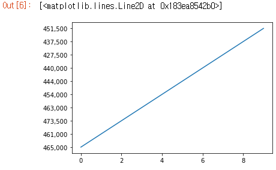

#  주식가격 스크래핑 하기


> Import

``` python
from selenium import webdriver
import time
import re
from urllib.request import urlopen
from bs4 import BeautifulSoup
import pandas as pd
```


> 스크래핑할 url / 데이터 확인

​	: 	스크래핑할 url 부터 확인하자

NaverFinance 의 메인 url	-	https://finance.naver.com/main/main.nhn

필자는 우선 삼성전자를 기준으로 테스트를 해보겠다

삼성전자의 주식정보 url 	-	 https://finance.naver.com/item/sise.nhn?code=005930


 일일가격정보를 보기 위해서는 중간 왼쪽부분에 "시세" 를 누르면 된다.


이것저것 많은 정보들이 있는데 나중에 기회가 되면 써보기로 하고 스크롤을 살짝 내리면 "일별시세가" 가 나온다. 이 부분을 "검사" 해주면 iframe 으로 링크가 걸려있음을 알 수 있다.

삼성전자의 일별시세에 해당하는 url	-	https://finance.naver.com/item/sise_day.nhn?code=005930

해당 링크로 이동해보면


 다음과 같이 날짜와 해당 날짜의 주식 정보들이 들어가 있다. "종가" 기준으로 스크래핑을 진행해보자.


> 삼성전자 스크래핑

​	: 	url에서 "날짜"와 "종가"만 빼내서 `DataFrame` 으로 저장해보자 ,  url 에 페이지부분을 추가해서 우선 10페이지에 해당하는 데이터들만 스크래핑 해보자. Selenium 을 안써도 무관하다.

```python
driver = webdriver.Chrome("./chromedriver.exe")

prices = []
date = []

# 우선 10 페이지만 테스트
for page in range(1,11):
    url = "https://finance.naver.com/item/sise_day.nhn?code=035720" + "&page=" + str(page)
    driver.get(url)
    date_sel = driver.find_elements_by_css_selector("span.tah.p10.gray03")
    price_sel= driver.find_elements_by_css_selector("span.tah.p11")
    for d in date_sel:
        date.append(d.text)
	# 가격은 매매종가 기준
    for i,p in enumerate(price_sel):
        if i% 6 == 0:
            prices.append(p.text)
            
df = pd.DataFrame({"price (종가)" : prices})
df.index = date
df
```


​	:	100개의 삼성전자 가격을 꺼내보았다. 이제 이걸로 그래프를 그려보자

```python
plt.plot(df["price (종가)"].values)
df["price (종가)"]
```


​	: 	값은 잘 들어갔는데 뭔가 문제가 있어 보인다. 확인해보기 위해 데이터 앞부분 10개만 확인해보자

```python
plt.plot(df["price (종가)"].values[0:10])
```



​	: 	아 이제보니 가격안에 ","이 들어가있다. 가격데이터를 `int` 타입이 아닌 `str` 타입으로 받아놓고 형변환을 잊어버렸다.  `int` 형으로 변환해주자


> 가격데이터 int 변환

​	:	int 형으로 변환하기 위해 `replace` 함수를 이용하여 "," 를 없애주자

```python
prices = []
date = []

# 우선 10 페이지만 테스트
for page in range(1,11):
    url = "https://finance.naver.com/item/sise_day.nhn?code=005930" + "&page=" + str(page)
    driver.get(url)
    date_sel = driver.find_elements_by_css_selector("span.tah.p10.gray03")
    price_sel= driver.find_elements_by_css_selector("span.tah.p11")
    for d in date_sel:
        date.append(d.text)

    for i,p in enumerate(price_sel):
        if i%6 == 0: prices.append(int(p.text.replace(',',"")))
            
df = pd.DataFrame({"price (종가)" : prices})
df.index = date
plt.plot(df["price (종가)"].values)
```


​	: 	`int` 형으로 바꾸었더니 정상적으로 출력되었다. 이제 좀 주식 가격 같아서 마음이 편안해진다. 

근데 그래프가 너무 허전하다. 뭔가 추가해보자.


> 그래프를 좀 더 그럴듯하게 그려보자

​	:	`platform` 라이브러리를 이용해서 한글폰트를 쓸 수 있도록 하고 제목/범례/X축/Y축을 추가해주었다. 

```python
from matplotlib import font_manager , rc
import platform

# matplot 에서 한글 폰트 사용
fn_name = font_manager.FontProperties(fname='c:/Windows/Fonts/malgun.ttf').get_name()
rc('font',family=fn_name)

# 좀 더 그럴듯하게 그려보기
plt.figure(figsize=(12,4))
plt.plot(df["price (종가)"] , label = "Price")
plt.title("주식 가격 그래프")
plt.xlabel("기준 년월")
plt.ylabel("주식 가격 (종가 기준)")
plt.legend()
plt.show()
```


​	: 	한글폰트를  사용하고 제목과 x축/y축/범례를 추가해주었다. 근데 x 축 상태가 이상하다

x축 값들이 모두 표현되면서 알아볼 수 없게 출력된거 같다. x 축 눈금을 알아볼 수 있도록 조정해보겠다.


> X 축 눈금 조정 

```python
plt.figure(figsize=(12,4))
plt.plot(df["price (종가)"] , label = "Price")
plt.title("주식 가격 그래프")
plt.xlabel("기준 년월")
plt.ylabel("주식 가격 (종가 기준)")
plt.legend()

# X 축에서 눈금이 len_xticks 개수만큼만 보이도록 설정
xticks = []
len_xticks = 10
for i in range(len(df)):
    num_divide = int(len(df)/len_xticks)
    if i%num_divide == 0:
        xticks.append(df.index[i])
xticks.append(df.index[-1])
plt.xticks(xticks)
plt.show()
```


​	:	그럴듯한 그래프가 나왔다 , 다만 최신순으로 데이터를 append 했기 때문에 그래프가 거꾸로 나왔다. 

그래프를 출력할 때는 `reverse` 로 뒤집어 주자. 이제 10 페이지가 아닌 `for`문 이 아닌 `while` 문을 이용해 삼성전자에 대한 일일매매가 데이터 전체 페이지를 스크래핑을 해보자


> 삼성전자 일일 가격 전체 페이지 스크래핑

​	:	이제 10페이지가 아닌 삼성전자 주가 가격이 담긴 모든 페이지를 스크래핑 해보자. NaverFinance 에서는 마지막페이지가 넘어가면 몇 페이지든간에 마지막페이지로 돌아오게 설정되있다. 따라서 마지막페이지인지 체크하기위해 이전 페이지의 날짜값을 저장하고 현재 페이지와 비교하면서 루프를 돌게 구현하였다. 

```python
code_number = "005930"
page = 0
prices = []
date = []

pv_date = ""
while(1):
    page += 1
    url = "https://finance.naver.com/item/sise_day.nhn?code=" + code_number + "&page=" + str(page)
    driver.get(url)
    date_sel = driver.find_elements_by_css_selector("span.tah.p10.gray03")
    price_sel= driver.find_elements_by_css_selector("span.tah.p11")
    
    now_date = date_sel[0].text
    if pv_date == now_date: break
    else:
        pv_date = now_date
    for d in date_sel:
        date.append(d.text)

    for i,p in enumerate(price_sel):
        if i% 6 == 0:
            prices.append(int(p.text.replace(",","")))
            
df = pd.DataFrame({"price(종가)" : prices})
df.index = date

df

```


​	:  총 6180 개의 데이터, 즉 6180일, 대략 17년 정도의 주식가격을 얻을 수 있었다. 생각보다 오래 걸리므로 시간이 없으신분들은 생략하고 넘어가자  

다음은 삼성전자가 아닌 종목을 코드번호로 입력받아 내가 원하는 종목을 스크래핑 할 수 있도록 해보자  


> 종목 코드를 입력받고 유효한지 확인

​	: 	먼저 이상한 종목 코드를 넣을 경우에는 친절하게 잘못된 종목코드라고 알려주도록 예외처리를 해보자. 실제 네이버 사이트에서 잘못된 종목코드로 이동하면 자동적으로 Error 메세지가 있는 링크로 이동이 되기 때문에 이를 감지하여 유효한 종목코드인지를 확인하는 함수를 만들었다

```python
def get_stock_prices(code_number):

    driver = webdriver.Chrome("./chromedriver.exe")
    url = "https://finance.naver.com/item/main.nhn?code=" + code_number
    driver.get(url)
    if driver.find_elements_by_css_selector("div.error_content"):
        print("잘못된 코드번호 입니다")
        return
    stock_name = driver.find_element_by_css_selector("div.wrap_company a").text
    print("코드 종목 : {} / 코드 번호 : {}".format(stock_name , code_number))
```


​	:   NaverFinance 에서 종목코드를 "00000" 으로 넣게되면 다음과 같은 페이지가 뜬다

만든 함수를 테스트 해보자

```python
get_stock_prices("000000")
get_stock_prices("293490")
```


​	: 	유효하지 않은 코드는 에러 메세지를, 유효하면 종목명과 종목코드를 출력하도록 만들었다.

여기에 이전의 스크래핑 코드를 `get_stock_prices` 안에 넣고 xlsx 파일로 저장하는 명령어를 넣어 완성해보자.


> 종목코드를 통해 원하는 주식 가격 전체 스크래핑 하기

```python
# 종목코드를 입력받아 전체 데이터 스크래핑
def get_stock_prices(code_number):
    
    driver = webdriver.Chrome("./chromedriver.exe")
    url = "https://finance.naver.com/item/main.nhn?code=" + code_number
    driver.get(url)
    if driver.find_elements_by_css_selector("div.error_content"):
        print("잘못된 코드번호 입니다")
        return
  
    stock_name = driver.find_element_by_css_selector("div.wrap_company a").text
    print("코드 종목 : {} / 코드 번호 : {}".format(stock_name , code_number))
    
    # 스크래핑
    prices = []
    date = []
    pv_date = ""
    page = 0
    while(1):
        page += 1
        url = "https://finance.naver.com/item/sise_day.nhn?code=" + code_number + "&page=" + str(page)
        driver.get(url)
        date_sel = driver.find_elements_by_css_selector("span.tah.p10.gray03")
        price_sel= driver.find_elements_by_css_selector("span.tah.p11")

        now_date = date_sel[0].text
        if pv_date == now_date: break
        else:
            pv_date = now_date
        for d in date_sel:
            date.append(d.text)

        for i,p in enumerate(price_sel):
            if i% 6 == 0:
                prices.append(int(p.text.replace(",","")))

    df = pd.DataFrame({"price(종가)" : prices})
    df.index = date
    save_name = code_number + " (" + stock_name + ")" + " Price.xlsx"
    if not os.path.exists("./data"): os.makedirs("./data")
    df.to_excel("./data/" + save_name , engine="openpyxl")
    print("Succesful Saving")            
    return
```

​	:  코드 대부분이 위에서 다뤘던거라 딱히 쓸게 없다. 생각보다 오래 걸리므로 돌려놓고 웹 서핑을 좀 해주거나 page = 600 정도를 넣어주면 일부분만 스크래핑한 결과를 볼 수 있다.

이제 저장한 xlsx 파일을 열어 plot 해보고 png 파일로 저장하는 시각화 작업을 해보자

  

> 엑셀파일을 열어서 plot 해보고 png 파일로 저장하기

```python
from matplotlib import font_manager, rc

# 파일 경로를 입력받아 그래프 출력/저장
def draw_graph(code_number):
    
    url = "https://finance.naver.com/item/main.nhn?code=" + code_number
    html = urlopen(url)
    bs = BeautifulSoup(html , "lxml")
 
    dir_path = "./data/"
    code_name =  bs.select("div.wrap_company a")[0].text
    try:
        path = dir_path + code_number + " (" + code_name + ") Price"
        df = pd.read_excel(path + ".xlsx", engine="openpyxl" , index_col= 0)

    except:
        print("Error - 종목코드를 확인하거나 데이터가 존재하는지 확인해주세요")
        return

    # 한글 폰트 문제
    fn_name = font_manager.FontProperties(fname='c:/Windows/Fonts/malgun.ttf').get_name()
    rc('font',family=fn_name)
        
    # 좀 더 그럴듯하게 그려보기
    plt.figure(figsize=(12,4))
    plt.plot(list(reversed(df.index)) , list(reversed(df["price(종가)"])) , label = "매매가 (종가)")
    plt.title(code_number + " (" + code_name + ") 가격 그래프")
    plt.xlabel("기준년월일")
    plt.ylabel("가격 (종가 기준)")
    xticks = []
    len_xticks = 10
    for i in range(len(df)):
        num_divide = int(len(df)/len_xticks)
        if i%num_divide == 0:
            xticks.append(df.index[i])
    xticks.append(df.index[-1])
    plt.xticks(xticks)
    plt.legend()
    plt.savefig(path + ".png")

    print("Saving Succesuflly")
    return
    
```


 	:	???? 그런데 그래프가 좀 이상하다... 도대체 2018년에 무슨 일이 일어난걸까?

찾아보니 삼성전자는 2018 5월 3일에 "액면분할" 을 통해 주가가 1/50 이 되었다고 나와있다... 아 손볼게 하나 늘었다 너무너무 귀찮다 그래도 냅두긴 좀 그러니 2018-05-03 기준으로 이전 주가들은 모두 1/50로 스케일링을 맞추도록 해보자


> 액면분할 주가 조정하기

​	:	다시 스크래핑하긴 시간이 걸리니 `DataFrame` 으로 불러와서 수정한 후 저장해주도록 하자

```python
# 2018년 5월 3일들부터 이전의 주가들만 1/50  , 입력값은 (종목코드 , 분할날짜, 분할비율)
def correct_value_division(code_number, division_date, division_rate):
    url = "https://finance.naver.com/item/main.nhn?code=" + code_number
    html = urlopen(url)
    bs = BeautifulSoup(html , "lxml")
    dir_path = "./data/"
    code_name =  bs.select("div.wrap_company a")[0].text
    try:
        path = dir_path + code_number + " (" + code_name + ") Price"
        df = pd.read_excel(path + ".xlsx", engine="openpyxl" , index_col= 0)
    except:
        print("Error - 종목코드를 확인하거나 데이터가 존재하는지 확인해주세요")
        return

    df.loc[division_date:] = df.loc[division_date:]/division_rate
    df.to_excel(path + ".xlsx", engine="openpyxl")
    return
```

​	:	이제 주가를 조정하고 그래프를 다시 출력해보자


```python
correct_value_division("005930" , "2018.05.03" , 50)
draw_graph("005930")
```


​	:	정상적인 모습으로 출력됬다.

 이렇게 종목코드를 입력받아 현재 시점에서 모든 일일매매가를 스크래핑해서 xlsx 로 저장하는 함수와 그래프로 시각화 하는 함수를 만들어 보았다. 시간이 지나면 또 데이터들이 쌓이기 때문에 꾸준히 데이터를 업데이트해줘야 하는데 그 때마다 매번 처음부터 새로 스크래핑하는 것은 매우 비효율적이다.  따라서 항상 모든 페이지를 새로 스크래핑해서 저장했던 `get_stock_prices` 함수를 이미 저장된 파일이 있다면 그 파일에서부터 이어서 스크래핑 하도록 바꾸어 보자


> 기존 xlsx 파일을 열어서 업데이트 하기

​	:  기존의 xlsx 파일을 열고 그 중 최근날짜와 NaveFinance 에 올라온 최근날짜를 비교해서 업데이트/저장

```python
# xlsx 파일을 열어서 업데이트 한다
def get_stock_prices(code_number , update = "True"):
    
    url = "https://finance.naver.com/item/main.nhn?code=" + code_number
    html = urlopen(url)
    bs = BeautifulSoup(html , "lxml")
    dir_path = "./data/"
    xlsx_name = dir_path + code_number + " (" + code_name + ") Price.xlsx"
    code_name =  bs.select("div.wrap_company a")[0].text
	
    
    try:
        df = pd.read_excel(path + ".xlsx", engine="openpyxl" , index_col= 0)
        latest_date = df.loc[0]
	except:
        latest_date = ""
    
    
    url = "https://finance.naver.com/item/main.nhn?code=" + code_number
    try:
        html = urlopen(url)
        bs = BeautifulSoup(html , "lxml")
        dir_path = "./data/"
        code_name =  bs.select("div.wrap_company a")[0].text
        path = dir_path + code_number + " (" + code_name + ") Price"
        df = pd.read_excel(path + ".xlsx", engine="openpyxl" , index_col= 0)
    except:
        print("Error - 종목코드를 확인하거나 데이터가 존재하는지 확인해주세요")
        return
    
    latest_date = df.index[0]
    page = 0
    date = []
    prices = []
    driver = webdriver.Chrome("./chromedriver.exe")
    while(1):
        page += 1
        url = "https://finance.naver.com/item/sise_day.nhn?code=" + code_number + "&page=" + str(page)
        driver.get(url)
        date_sel = driver.find_elements_by_css_selector("span.tah.p10.gray03")
        price_sel= driver.find_elements_by_css_selector("span.tah.p11")

        now_date = date_sel[0].text
        print(latest_date , now_date)
        if latest_date == now_date: 
            break
            
        for d in date_sel:
            date.append(d.text)

        for i,p in enumerate(price_sel):
            if i% 6 == 0:
                prices.append(int(p.text.replace(",","")))

    #     # 가장 최신 데이터까지 확인하면 탈출
    #     if date_sel[0].text == last_date: break
    print(date)
    driver.close()
```


## 3. 전체 코드

```python
# Import
from selenium import webdriver
import time
import re
from urllib.request import urlopen
from bs4 import BeautifulSoup
import pandas as pd
import matplotlib.pyplot as plt

# 종목코드를 입력받아 전체 데이터 스크래핑
def get_stock_prices(code_number):
    
    driver = webdriver.Chrome("./chromedriver.exe")
    url = "https://finance.naver.com/item/main.nhn?code=" + code_number
    driver.get(url)
    if driver.find_elements_by_css_selector("div.error_content"):
        print("잘못된 코드번호 입니다")
        return
  
    stock_name = driver.find_element_by_css_selector("div.wrap_company a").text
    print("코드 종목 : {} / 코드 번호 : {}".format(stock_name , code_number))
    
    # 스크래핑
    prices = []
    date = []
    pv_date = ""
    while(1):
        page += 1
        url = "https://finance.naver.com/item/sise_day.nhn?code=" + code_number + "&page=" + str(page)
        driver.get(url)
        date_sel = driver.find_elements_by_css_selector("span.tah.p10.gray03")
        price_sel= driver.find_elements_by_css_selector("span.tah.p11")

        now_date = date_sel[0].text
        if pv_date == now_date: break
        else:
            pv_date = now_date
        for d in date_sel:
            date.append(d.text)

        for i,p in enumerate(price_sel):
            if i% 6 == 0:
                prices.append(int(p.text.replace(",","")))
    prices.reverse()
    date.reverse()
    df = pd.DataFrame({"price(종가)" : prices})
    df.index = date
    save_name = stock_name + " stock price.xlsx"
    df.to_excel(save_name , engine="openpyxl")
    print("Succesful Saving")            
    return

# 파일 경로를 입력받아 그래프 출력/저장
def draw_graph(savepath = ""):
    # 로드
    df = pd.read_xlsx(savefile) 
    # matplot 에서 한글 폰트 사용
    if platform.system() == "Windows":
        path =  "c:/Windows/Fonts/malgun.ttf"
        font_name = font_manager.FontProperties(fname=path).get_name()
        rc('font' , family =  font_name)
    # 좀 더 그럴듯하게 그려보기
    plt.figure(figsize=(12,4))
    plt.plot(df.index , df["price (종가)"])
    plt.title("주식 가격 그래프")
    plt.xlabel("기준 년월")
    plt.ylabel("주식 가격 (종가 기준)")
    xticks = []
    len_xticks = 10
    for i in range(len(df)):
        num_divide = int(len(df)/len_xticks)
        if i%num_divide == 0:
            xticks.append(df.index[i])
    xticks.append(df.index[-1])
    plt.xticks(xticks)
    plt.show()
    plt.savefile(".png")

```

```python
# 테스트
code_number = ""
get_stock_prices()
draw_graph()
```